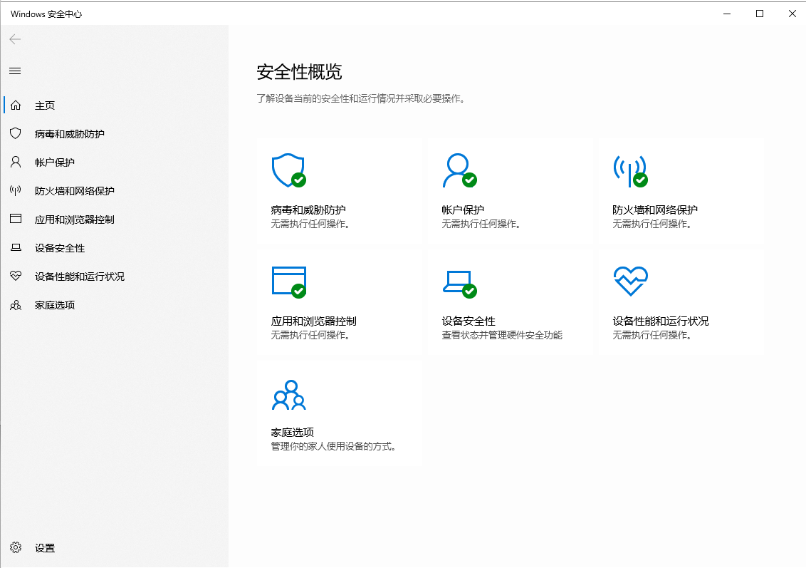
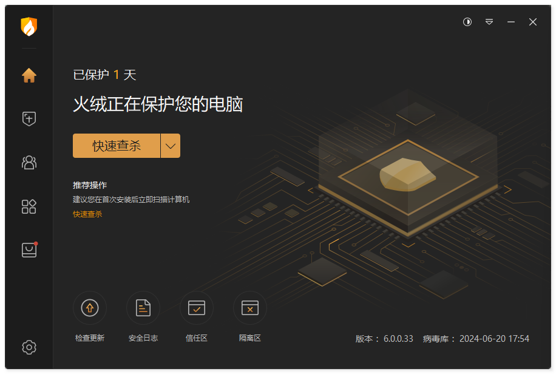
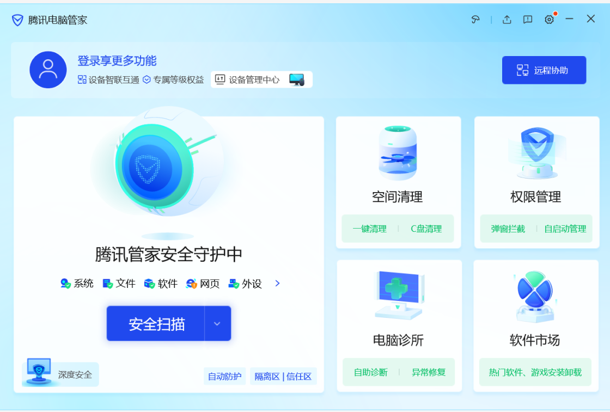
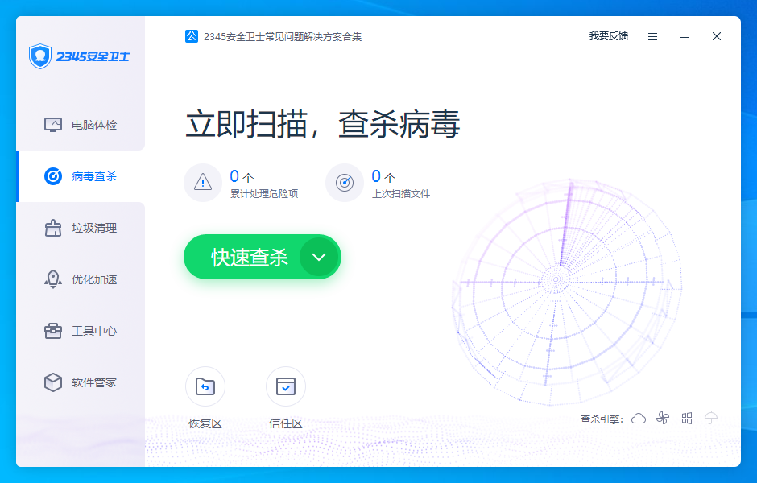
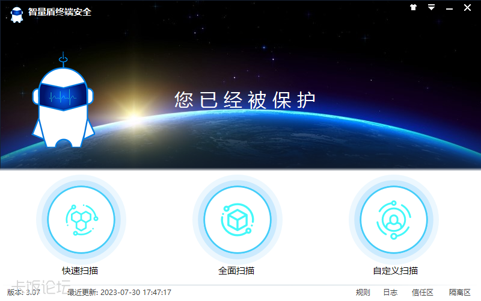

今天，来和大家谈谈杀毒软件的选择，我会尽可能地列举市面上常见的杀软（实在冷门的除外，比如费尔和微点等，这些冷门的也不推荐用，如果有遗漏的不错的杀软欢迎联系我补充），但难免遗漏~~（冷门的你用它干嘛）~~，不过这只是我的经验之谈，具体数据什么的我就不做了，大家可以去看看AV-C或者自己测试。**不过我仍会尽力保证评价每款杀软时公正客观，但是可能有部分杀软的评价比较尖锐，有问题可以联系我更改**。

如果有一些词汇看不懂，可以去网上查查，多数都有解释

*量太大，一次性写完太久，先放点出来给各位看看，后面慢慢更~*

## 为什么要装杀软及杀软的意义

另外有人会觉得杀软没有什么用，不乱下载东西就可以了，但是对于我这种天天逛外网、翻破解的人来说，防护就是刚需，比如说我的各种账号也许相比企业政府啥的不值一提，但是不代表就没人盯上，你的steam账号啥的难道一文不值？有的黑客是广撒网，不能抱着侥幸心理。最危险的是有些人分得了公网ip自己还不懂，电脑暴露在公网却没有任何安全措施，更新和防火墙都关着，这种电脑黑客看到嘴角比AK都难压，当然，黑客并不会闲的来自己黑你电脑，大多数情况下是黑客写的脚本自动扫描那些有漏洞的电脑攻击，你所感觉到的网络攻击变少了其实是你在内网。病毒这东西防住一万个都没事，就怕有一个漏网之鱼。不过，**杀软也不是万能的**，任何一款杀软都不能做到100%拦截，**杀软存在的目的就是让你的价值远高于攻击成本**，杀软也只是工具，不能过度依赖工具。

下面介绍一些常见杀软：

## WindowsDefender

相信这个大家耳熟能详了，微软的杀软，在Windows10及以上系统才变得好用起来，但是这个口碑很难说，有人说这个很强够用了，有人说这玩意史都不如。我认为呢虽然它频频在AVC测试中等测试中取得好成绩，但是在一些民间测试里表现并不亮眼，但总的来说不是很拉跨，算是杀软守门员吧，如果连WD都比不过确实不配称为杀软。

有人可能会问，为什么别人的WD这么强？是因为他们用了自定义策略，策略调好了的WD很强的，这里推荐[DefenderUI](https://www.cyberlock.global/DefenderUI.aspx)这个免费的小工具，显著提高了可用性并解锁了许多隐藏的安全功能。

不过，一个恐怖的事实是，自从CrowdStrike大规模蓝屏事件后，微软正打算把杀软移出系统内核，尽管是为了兼容性，但是我认为这和因噎废食没区别，弊大于利。很明显的，如果真那么做，那么WD一定会对其他杀软形成垄断。

**优点：**

* 个人免费用，内置在Windows中，开箱即用，不用折腾

* 不流氓，无广告，省心

* 还说得过去的机学（机器学习，Machine Learning）和速度不慢的云拉黑

* 微软官方出品，有着得天独厚的兼容性优势

**缺点：**

* 对我来说难用的交互

* 误报控制不佳

* 性能并不优秀

* 杀毒能力说的过去，但并不优秀，修复能力差

* 免杀和绕过defender貌似并不难，据说还成基本业务了

* 不知道有没有主动防御，似乎交互上没体现出来

## 360

这个也是耳熟能详了，国内知名老牌杀软，有着褒贬不一的口碑。不过360的整体强度还不错，云和单步主防玩得很明白，之前有次试图写强杀360的程序，被拦了几次改了几次代码被云上传后QVM特征了。

不过，目前360似乎已经不那么重视个人产品了，毕竟在口碑日益败坏的今天估计是挣不到钱了，全靠云撑着，这点可以从去年银狐肘360到现在可以体现出来。目前360似乎是云为主，主防辅杀的的策略，可能正如一些人所说，360可能宁可多点钱维护服务器也不愿意再投入大量资金进行研发了。

**优点：**

* 极其迅速的云拉黑（有人说云拉黑和入库都没什么用，防不住新威胁，但我认为，在病毒威胁到大部分用户前及时拉黑也未尝不是一种策略）

* 单步主防不错，拦截点多，同时因为有云的信誉库支持所以不会像冰盾这些HIPS无脑报弹窗多

* 老厂，病毒库庞大，技术积累深厚

* 因为重云的策略，缓解了本地压力，资源占用不高

* 误报控制好

* 操作简单利于新手，有用小工具也很多

**缺点：**

* 有点流氓，一些广告需要到设置手动去关

* 由于其知名度，通常为病毒的首要针对对象

* 重云策略是双刃剑，不能第一时间拦截就是其弊端

* 仅有单步主防，应对白加黑比较吃力，并且无回滚使其及时后续拦截也无法恢复先前造成的破坏，也无法对威胁造成的一些系统变化（文件衍生、注册表修改等）进行处理，防御的仅仅是该样本的恶意行为

* 断网时几乎残废

* 启发貌似用处不大，更多的是依赖云md5病毒库，面对新威胁基本无能为力，只能说是聊胜于无

## 火绒

备受欢迎的杀软，完全纯净无流氓为其赢得了很好的口碑。官方的态度也非常的好，常常出现在各种视频里要样本，同时也常免费的为因火绒而遇到问题的用户答疑解惑，这点实属难能可贵。其防护方面我认为是及格了的，起码来说够用，防护够全面，有国内罕见的多步主防+单步主防，高启发，扫描还有沙盒，甚至网络防护还能加固一下mySQL之类的。从火绒发布至今一直在进步，从5.0到6.0防护和ui已经进步很多了，即使目前实力仍不能让人满意，但是其态度之好有目共睹，相信火绒未来可期。

**优点：**

* 纯净，无流氓

* 官方态度好且积极

* 实用的小工具多

* 全面且合格的防护，算是一个小六边形战士？

* 比较不错的HIPS，并且可以高度可自定义

* 断网环境下影响不大，只要保证病毒库按时更新即可

**缺点：**

* 没有云，仅有每日一更的病毒库，应急响应不快

* 启发目前特征库不大，对于扫描的增幅并不大

* 多步主防（恶意行为实时监控）做得貌似并不好，很少看到报毒，也没有发挥出多步主防的优势，唯一能回滚的只有检测到勒索后恢复备份的文件。勒索诱捕不仅数量少并且位置阴间，放在火绒目录下

* 由于信誉库不大并且机制似乎不好，HIPS全开会很多弹窗，有时系统的都不放过，这也就导致了火绒为照顾啥也不会的新手，默认关掉了部分防护

* 防护只能说及格但算不上优秀，给人的感觉是啥都能干但是并无一方面专精，有条件的可以使用其他杀软进行补充

* 尽管可自定义的HIPS提高了火绒的上限，但上限取决于写规则的人，而且不适合大多数用户

* 火绒始终不肯引入驱动级主防，虽然这么做也有道理，一定程度上降低了系统出现底层故障的风险（之前全球大规模蓝屏就是CrowdStrike驱动bug的锅），但是代价的防护的脆弱，这也导致了能强杀火绒的样本并不少

## 腾讯电脑管家

腾讯家的杀软，不过对腾管来说，大厂出品≠精品，有点流氓但又没有那个当流氓的实力。防护貌似连defender都不如，用这个还不如不用让系统自带的defender接管。据说这个杀软只是腾讯内部给刚实习的大学生练手的项目，尽管这个说法无从考究，但就腾讯这种级别的大厂做出的这种产品很难不让人往这方面想。

**优点：**

* 勉勉强强能当个工具箱用

* 抓银狐特征还是有点积极的，起码比360积极

**缺点：**

* 有点流氓，而且啥功能都往上加，甚至还能登录qq账号，导致其有点臃肿

* 防护官方吹得再厉害也没用，实际上可能连火绒都不如

## 金山毒霸

国内的著名老牌杀软，但老牌≠强大，无论这款杀软当年有多辉煌，现在都是没落了，金山的重心都在给企业提供防护和其它业务，个人版就是不断换皮继续卖，想榨干最后一点油水罢了。现在金山毒霸的策略很尴尬，搞了个VIP制度，但是免费的有比它更强更好用的，付费的也有比它更强更好用的，其自身也有点流氓。defender都比这玩意好用多了，如果不是为了情怀还是别用了吧。

**优点：**

* 瘦死的骆驼比马大，毕竟是老厂，还是有点技术积累的，比如金山的急救箱就还可以，对付一些旧的顽固病毒不错

**缺点：**

* 性价比不高

* 已经落后于时代的防护

* 有点流氓

* 官方已经不上心了，估计也是知道不挣钱

## 瑞星

也是著名老牌杀软了，但是和金山一样尴尬的情况，以前还免费，现在转向完全付费，但是又没有那个实力，还是不如自带的免费的defender。一年一百多反正我是觉得没啥性价比，6块钱一年的麦咖啡和15一年的卡巴比这香多了。这也引出了个恶性循环，没啥用户买就不会往上面砸多少资源，不砸资源就防护就会落后，就更没人买了。如果不是情怀还是别用了。

**优点：**

* 同金山，毕竟是老厂，还是有点技术积累的

**缺点：**

* 性价比不高

* 防护聊胜于无，可能还不如火绒

* 官方对个人版态度不积极，估计也是重心在企业

## 2345安全卫士

写这个就是为了给萌新避坑的，这就是个流氓下载器，和杀软完全不搭边，如果发现已经装了去b站上找找卸载教程吧。**求你了，裸奔都不要用这个，对自己好点**。

~~细心点你可能会注意到我单单没给2345配网站，我怕误导萌新~~

**优点：**

* 有个残血红伞引擎

**缺点：**

* 古希腊掌握流氓的神

* 很难卸载，据说卸载还会死灰复燃

* 聊胜于无的防护

## 智量盾终端安全

往日的神，时代的眼泪。智量盾是国内首家主打机学的NGAV杀软，有着和火绒一样的单步主防+多步主防的组合，但是其多步主防和火绒相比完全不在一个量级上，智量的多步主防有着真正的回滚能力。据很多民间测试来看，当年的智量极其强悍，机学的查杀率非常恐怖，有时甚至超过了ESET，尽管误报高，但是国内的机学能做到这样很难得了；智量的主防更加恐怖，甚至时至今日仍然能在一众杀软翻车的样本上爆冷门，当年的智量是真的能靠主防走天下。最关键的是，智量完全免费不流氓，算是当时为数不多平民级NGAV了

智量这一款及其强悍的杀软，理应带领中国杀软走向世界，最大做强，对吧？可是为什么有点冷门呢？因为可惜的是，在2023年初，智量停止服务，据说是核心人员被华为挖走了，虽无从考究，但这一国产杀软的黑马，却出师未捷身先死，实在令人叹息。不过也能理解，智量这个产品貌似自18年出第一个版本开始就没挣过钱，在群里官方人员也曾说过有意做成付费制，免费版阉割防火墙，可惜没能做下去。

**优点：**

* 极其强悍的多步主防和机学

* 高情商：纯粹的防护

* 即使在2025年，还是有很多杀软的主防强度不如智量，实在是超前

**缺点：**

* 因为已长期无人维护，因此现在除了测试或者是玩玩，否则**我不推荐任何人使用**，据一位大佬（bilibili@LumineDefQwQ）所说，智量对于新系统的适配性已经很差了（比如很多hook失效，进程启动监控对64位程序失效等），之前也出现过误杀反作弊驱动的事，难免以后不会再出现什么误报。

* 低情商：工具少，从图中应该也看得出来，主页除了扫描就没了

* 智量的自保其实很脆，且由于长期停更，现在也存在完善的绕过策略，只是因为冷门逃过一劫

* 因为长期停更，机学的特征已经停滞很久了，面对新威胁已经无能为力，所以目前能用的只有智量的主防

## 冰盾主动防御系统

