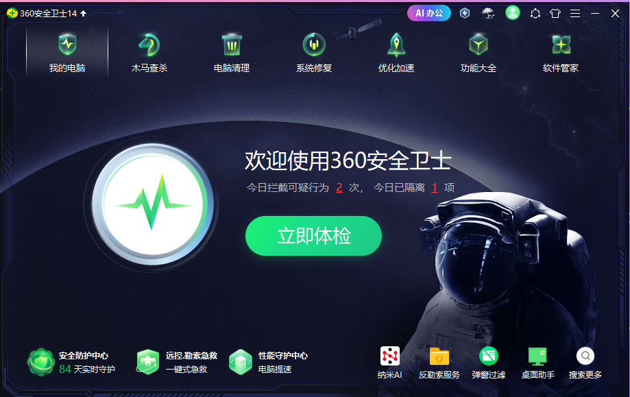
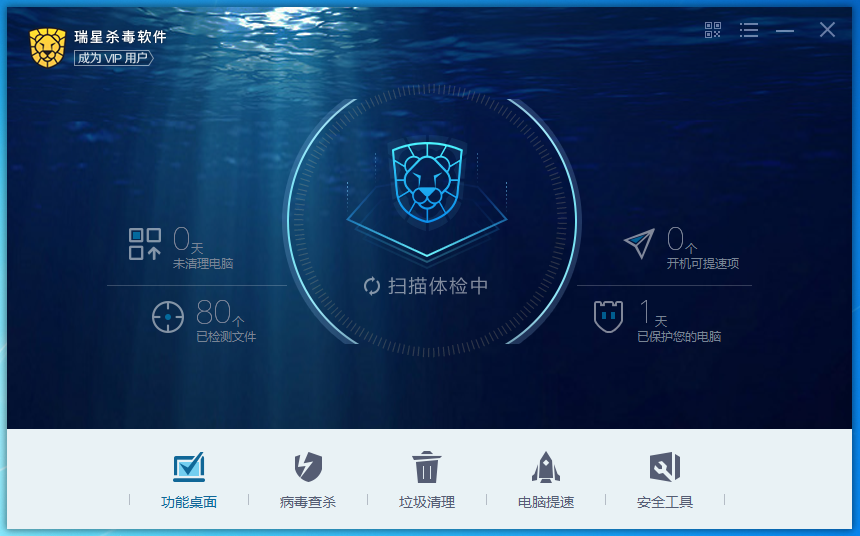

今天，来和大家谈谈杀毒软件的选择，我会尽可能地列举市面上常见的杀软（实在冷门的除外，比如费尔和微点等，这些冷门或者停更的也不推荐用，如果有遗漏的不错的杀软欢迎联系我补充），但难免遗漏~~（冷门的你用它干嘛）~~，不过这只是我的经验之谈，具体数据什么的我就不做了，大家可以去看看AV-C或者自己测试。**不过我仍会尽力保证评价每款杀软时公正客观，但是可能有部分杀软的评价比较尖锐，有问题可以联系我更改**

**观前叠盾：我在事先没有收到过一分钱，如果你认为你的杀软很好用但是我给出了负面的评价你可以继续用当这篇文章是乐子写的，没必要和我对线浪费彼此时间，错误的你可以联系我更改，但是我不接受片面的情绪化的观点**。

如果有一些词汇看不懂，可以去网上查查，多数都有解释

*量太大，一次性写完太久，先放点出来给各位看看，后面慢慢更~*

## 为什么要装杀软及杀软的意义

另外有人会觉得杀软没有什么用，不乱下载东西就可以了，但是对于我这种天天逛外网、翻破解的人来说，防护就是刚需，比如说我的各种账号也许相比企业政府啥的不值一提，但是不代表就没人盯上，你的steam账号啥的难道一文不值？有的黑客是广撒网，不能抱着侥幸心理。最危险的是有些人分得了公网ip自己还不懂，电脑暴露在公网却没有任何安全措施，更新和防火墙都关着，这种电脑黑客看到嘴角比AK都难压，当然，黑客并不会闲的来自己黑你电脑，大多数情况下是黑客写的脚本自动扫描那些有漏洞的电脑攻击，你所感觉到的网络攻击变少了其实是你在内网。病毒这东西防住一万个都没事，就怕有一个漏网之鱼。不过，**杀软也不是万能的**，任何一款杀软都不能做到100%拦截，**杀软存在的目的就是让攻击成本远高于你的价值**，但杀软也只是工具，不能过度依赖工具，比如说有杀软误报低，报毒就100%相信，这是不对的，还是要自己学着去看一下报毒名，ESET的报毒分类就很准，也很容易看得懂。

下面介绍一些常见杀软：

## WindowsDefender

相信这个大家耳熟能详了，微软的杀软，在Windows10及以上系统才变得好用起来，但是这个口碑很难说，有人说这个很强够用了，有人说这玩意史都不如。我认为呢虽然它频频在AVC测试中等测试中取得好成绩，但是在一些民间测试里表现并不亮眼，但总的来说不是很拉跨，算是杀软守门员吧，如果连WD都比不过确实不配称为杀软。

有人可能会问，为什么别人的WD这么强？是因为他们用了自定义策略，策略调好了的WD很强的，这里推荐[DefenderUI](https://www.cyberlock.global/DefenderUI.aspx)这个免费的小工具，显著提高了可用性并解锁了许多隐藏的安全功能。

不过，一个恐怖的事实是，自从CrowdStrike大规模蓝屏事件后，微软正打算把杀软移出系统内核，尽管是为了兼容性，但是我认为这和因噎废食没区别，弊大于利。很明显的，如果真那么做，那么WD一定会对其他杀软形成垄断。

**优点：**

* 个人免费用，内置在Windows中，开箱即用，不用折腾

* 不流氓，无广告，省心

* 还说得过去的机学（机器学习，Machine Learning）和速度不慢的云拉黑

* 微软官方出品，有着得天独厚的兼容性优势

**缺点：**

* 对我来说难用的交互

* 误报控制不佳

* 性能并不优秀

* 杀毒能力说的过去，但并不优秀，修复能力差

* 免杀和绕过defender貌似并不难，据说还成基本业务了

## 360

这个也是耳熟能详了，国内知名老牌杀软，有着褒贬不一的口碑。不过360的整体强度还不错，云和单步主防玩得很明白，之前有次试图写强杀360的程序，被拦了几次改了几次代码被云上传后QVM特征了。

不过，目前360似乎已经不那么重视个人产品了，毕竟在口碑日益败坏的今天估计是挣不到钱了，全靠云撑着，这点可以从去年银狐肘360到现在可以体现出来。目前360似乎是云为主，主防辅杀的的策略，可能正如一些人所说，360可能宁可多点钱维护服务器也不愿意再投入大量资金进行研发了。

**优点：**

* 极其迅速的云拉黑（有人说云拉黑和入库都没什么用，防不住新威胁，但我认为，在病毒威胁到大部分用户前及时拉黑也未尝不是一种策略）

* 单步主防不错，拦截点多，同时因为有云的信誉库支持所以不会像冰盾这些HIPS无脑报弹窗多

* 老厂，病毒库庞大，技术积累深厚

* 因为重云的策略，缓解了本地压力，资源占用不高

* 误报控制好

* 操作简单利于新手，有用小工具也很多

**缺点：**

* 有点流氓，一些广告需要到设置手动去关

* 由于其知名度，通常为病毒的首要针对对象

* 重云策略是双刃剑，不能第一时间拦截就是其弊端

* 仅有单步主防，应对白加黑比较吃力，并且无回滚使其及时后续拦截也无法恢复先前造成的破坏，也无法对威胁造成的一些系统变化（文件衍生、注册表修改等）进行处理，防御的仅仅是该样本的恶意行为

* 断网时几乎残废

* 启发貌似用处不大，更多的是依赖云md5病毒库，面对新威胁基本无能为力，只能说是聊胜于无

## 火绒

备受欢迎的杀软，完全纯净无流氓为其赢得了很好的口碑。官方的态度也非常的好，常常出现在各种视频里要样本，同时也常免费的为因火绒而遇到问题的用户答疑解惑，这点实属难能可贵。其防护方面我认为是及格了的，起码来说够用，防护够全面，有国内罕见的多步主防+单步主防，高启发，扫描还有沙盒，甚至网络防护还能加固一下mySQL之类的。从火绒发布至今一直在进步，从5.0到6.0防护和ui已经进步很多了，即使目前实力仍不能让人满意，但是其态度之好有目共睹，相信火绒未来可期。

**优点：**

* 纯净，无流氓

* 官方态度好且积极

* 实用的小工具多

* 全面且合格的防护，算是一个小六边形战士？

* 比较不错的HIPS，并且可以高度可自定义

* 断网环境下影响不大，只要保证病毒库按时更新即可

**缺点：**

* 没有云，仅有每日一更的病毒库，应急响应不快

* 启发目前特征库不大，对于扫描的增幅并不大

* 多步主防（恶意行为实时监控）做得貌似并不好，很少看到报毒，也没有发挥出多步主防的优势，唯一能回滚的只有检测到勒索后恢复备份的文件。勒索诱捕不仅数量少并且位置阴间，放在火绒目录下

* 由于信誉库不大并且机制似乎不好，HIPS全开会很多弹窗，有时系统的都不放过，这也就导致了火绒为照顾啥也不会的新手，默认关掉了部分防护

* 防护只能说及格但算不上优秀，给人的感觉是啥都能干但是并无一方面专精，有条件的可以使用其他杀软进行补充

* 尽管可自定义的HIPS提高了火绒的上限，但上限取决于写规则的人，而且不适合大多数用户

* 火绒始终不肯引入驱动级主防，虽然这么做也有道理，一定程度上降低了系统出现底层故障的风险（之前全球大规模蓝屏就是CrowdStrike驱动bug的锅），但是代价的防护的脆弱，这也导致了能强杀火绒的样本并不少

## 腾讯电脑管家

腾讯家的杀软，不过对腾管来说，大厂出品≠精品，有点流氓但又没有那个当流氓的实力。防护貌似连defender都不如，用这个还不如不用让系统自带的defender接管。据说这个杀软只是腾讯内部给刚实习的大学生练手的项目，尽管这个说法无从考究，但就腾讯这种级别的大厂做出的这种产品很难不让人往这方面想。

**优点：**

* 勉勉强强能当个工具箱用

* 抓银狐特征还是有点积极的，起码比360积极

**缺点：**

* 有点流氓，而且啥功能都往上加，甚至还能登录qq账号，导致其有点臃肿

* 防护官方吹得再厉害也没用，实际上可能连火绒都不如

## 金山毒霸

国内的著名老牌杀软，但老牌≠强大，无论这款杀软当年有多辉煌，现在都是没落了，金山的重心都在给企业提供防护和其它业务，个人版就是不断换皮继续卖，想榨干最后一点油水罢了。现在金山毒霸的策略很尴尬，搞了个VIP制度，但是免费的有比它更强更好用的，付费的也有比它更强更好用的，其自身也有点流氓。如果不是为了情怀还是别用了吧。

**优点：**

* 瘦死的骆驼比马大，毕竟是老厂，还是有点技术积累的，比如金山的急救箱就还可以，对付一些旧的顽固病毒不错

**缺点：**

* 性价比不高

* 已经落后于时代的防护

* 有点流氓

* 官方已经不上心了，估计也是知道不挣钱

## 瑞星

也是著名老牌杀软了，但是和金山一样尴尬的情况，以前还免费，现在转向完全付费，但是又没有那个实力，还是不如自带的免费的defender。一年一百多反正我是觉得没啥性价比，6块钱一年的麦咖啡和15一年的卡巴比这香多了。这也引出了个恶性循环，没啥用户买就不会往上面砸多少资源，不砸资源就防护就会落后，就更没人买了。如果不是情怀还是别用了。

**优点：**

* 同金山，毕竟是老厂，还是有点技术积累的

**缺点：**

* 性价比不高

* 防护聊胜于无，可能还不如火绒

* 官方对个人版态度不积极，估计也是重心在企业

## 2345安全卫士

写这个就是为了给萌新避坑的，这就是个流氓下载器，和杀软完全不搭边，如果发现已经装了去b站上找找卸载教程吧。**求你了，裸奔都不要用这个，对自己好点**。

~~细心点你可能会注意到我单单没给2345配网站，我怕误导萌新~~

**优点：**

* 有个残血红伞引擎

**缺点：**

* 古希腊掌握流氓的神

* 很难卸载，据说卸载还会死灰复燃

* 聊胜于无的防护

## 智量盾终端安全

往日的神，时代的眼泪。智量盾是国内首家主打机学的NGAV（NextGen AntiVirus）杀软，有着和火绒一样的单步主防+多步主防的组合，但是其多步主防和火绒相比完全不在一个量级上，智量的多步主防有着真正的回滚能力。据很多民间测试来看，当年的智量极其强悍，机学的查杀率非常恐怖，有时甚至超过了ESET，尽管误报高，但是国内的机学能做到这样很难得了；智量的主防更加恐怖，甚至时至今日仍然能在一众杀软翻车的样本上爆冷门，当年的智量是真的能靠主防走天下。最关键的是，智量完全免费不流氓，算是当时为数不多平民级NGAV了

可惜的是，在2023年初，智量停止服务，据说是核心人员被华为挖走了，虽无从考究，但这一国产杀软的黑马，却出师未捷身先死，实在令人叹息。不过也能理解，智量这个产品貌似自18年出第一个版本开始就没挣过钱，在群里官方人员也曾说过有意做成付费制，免费版阉割防火墙，可惜没能做下去。

**优点：**

* 极其强悍的多步主防和机学

* 高情商：纯粹的防护

* 即使在2025年，还是有很多杀软的主防强度不如智量，实在是超前

**缺点：**

* 因为已长期无人维护，因此现在除了测试或者是玩玩，否则现在**我不推荐任何人使用**，据一位大佬（bilibili@LumineDefQwQ）所说，智量对于新系统的适配性已经很差了（比如很多hook失效，进程启动监控对64位程序失效等），之前也出现过误杀反作弊驱动的事，难免以后不会再出现什么误报。并且智量不会注册安全中心，所以WD不会关闭。

* 低情商：工具少，从图中应该也看得出来，主页除了扫描就没了

* 智量的自保其实很脆，且由于长期停更，现在也存在完善的绕过策略，只是因为冷门逃过一劫

* 修复能力很差（毕竟机学也不是用来修复文件的）

* 因为长期停更，机学的特征已经停滞很久了，面对新威胁已经无能为力，所以目前能用的只有智量的主防

## 冰盾主动防御系统

国产HIPS，目前看来还不错，就是完完全全的单步主防，如果倒腾过毛豆HIPS的应该很熟悉，目前是半付费，部分规则和内核防御需要付费，但其实免费的规则也够用了。目前可做为主防差的杀软的补充防护，不建议单奔，而且初期使用有大量弹窗，需要学习模式用一段时间才好。内置规则还行，但是要更强还是得自己写，总的来说不是很适合新手用，这个HIPS更偏向手动而非智能HIPS

**优点：**

* 高度可自定义，强度取决于规则

**缺点：**

* 目前不算很热门，没有多少大佬的规则

* 上手难度高

## 卡巴斯基

毛子家的老牌杀软，也有着毛子的彪悍之风。本土化做的很优秀，以至于老网民对此印象都很深。卡巴以自己的实力赢来了很好的口碑，鼎盛时期的主防见谁秒谁。卡巴有着强悍的多步主防，回滚也很优秀。同时云响应快，扫描查杀率不低，这使得卡巴成为了六边形战士，扫描过了还有主防打底。据说卡巴内存特征库是做的很好的一批。误报控制很优秀，对于破解和修改器这些很宽容，可以说是很深入国内市场的一线杀软了。

但是前面为什么说“鼎盛时期”呢？注意一下关键词“毛子家的老牌杀软”，最近的国际形势懂得都懂，下面附上百度百科的一段话

>当地时间2024年6月20日，美国商务部长吉娜·雷蒙多宣布，出于对美国国家安全的考虑，政府将采取措施禁止卡巴斯基实验室及其所有附属公司、子公司和母公司在美国提供网络安全和防病毒软件，并将三家卡巴斯基相关实体添加到“实体名单”中，以使其无法在美国销售或更新软件。

据说卡巴挣扎过，可惜还是没能逃脱制裁的命运。丢失了欧美市场后卡巴的更新渐渐乏力，核心技术仍然停留在2021年版本，最近的更新就是一直在水版本号，就拿截至目前卡巴最新版本21.22的更新日志举例

>最新版本的应用程序引入了以下新功能和改进：
>
> * 增加了对 hCaptcha 的支持。
>
> * 当用户尝试下载网络邮件中的附件时，实施反病毒检查。
>
> * 网络摄像头和麦克风控制。改进了通知。
>
> * 改进了客户支持导航和数据预填充，以获得更高效的产品体验。
>
> * 卡巴斯基保护扩展程序。增加了对 Opera 浏览器的支持。
>
> * 我们通过实施 Blob 钓鱼检测机制改进了安全浏览功能。
>
> * 备用激活码无法再本地保存，但仍可添加到“我的卡巴斯基”中。

这不是啥也没更吗。可惜的是，卡巴最近的更新一直处于这种更了但好像没更的状态，这点也可以从官网仍然提供21.3版本就可以看出来。最近的重心似乎在往云和自家的云沙箱转移，希望不要走上360的路。

个人还有一个不严谨的猜测，前段时间卡巴大更op（自家云沙箱），也许是完善后打算下发给付费版用户？

不过，尽管如此，想用还是可以用的，卡巴目前还是很不错的，免费版也很大方，最值钱的主防直接就给了，和付费版就少了防火墙和单步主防。有时付费版还有15块钱一年的活动，不过我没注意过，平时各位可以多注意一下卡饭论坛，里面经常有卡巴的消息。如果你想买的话建议买标准版，标准版与价格更高的版本防护一致，唯一的区别就是功能的多少，但是多的功能至少对我而言根本用不上，多花一百多不值得。

这里也纠正下误区，不要看别人天天刷什么“卡巴死机”就觉得很卡，都是开个玩笑的，之前的卡巴确实卡，现在的性能控制已经很好了，只要不是4GB老爷机日用是无感的。

**优点：**

* 本土化优秀，误报低

* 云响应很快

* 有着稳定且强悍的驱动级主防，自保也很强

* 启发和机学特征也很不错

* 免费版大方而且不流氓

**缺点：**

* 最近的更新并没有大的更新，翻车的次数似乎也比以前更多了，个人感觉主防明显没那么灵敏了

* 似乎卡巴是更依赖云了，最近很多样本都是最初扫不出来然后别人上传到云沙箱后被拉黑了

* 新版感觉变得有一点点臃肿，啥工具不管有用没用都往里塞，不过也不算太难受，日常使用还是无感的

* 技术没多大进步，营销倒是进步挺快的，21.3版本主页显示的还是“保护已生效”，现在变成了“您已处于我们强大的保护之中”，各种没用的工具可能是想和友商竞争吧

## ESET NOD32

来自斯洛伐克的老牌杀软，是为数不多目前还死磕本地特征重扫描的杀软了，但是死磕特征不等于落后，ESET的技能点差不多全点扫描上了，这就使得ESET的查杀率很高，而且启发和机学非常强，比如说银狐吧，被特征了变种很难躲过ESET的启发，如果ESET查不出来那其他都差不多。据说ESET的扫描还能穿很多强壳，内存扫描进一步发挥了扫描的优势，并且断网查杀率仍然不低。

不过呢，虽然扫描很强，但是执行后保护就很差了，主防的话是HIPS，但是感觉这个HIPS存在感不强，规则也不多，可能还不如火绒，能加强执行后保护的ESETLiveGuard（ESET家的云沙箱）还是ESSP才有的，但是ESSP大几百一年……反正不是我能消费得起的。不止ESSP，其它档次的ESET产品也不下百，可能有时打折或者有第三方渠道便宜点，但也不会有类似卡巴15一年和迈克菲6块一年的白菜价，也没有免费版，最低的档次是NOD32 AntiVirus，个人感觉有点抠~~（不过比起瑞星金山还是对得起这个价的）~~

总的来说瑕不掩瑜，ESET的本土化不差，误报控制很强。因为重扫描的策略资源占用并不高，ESET也精益求精使得资源占用这方面鲜有能与其匹敌的杀软。从近期的AV-C等测试机构和民间测试来看ESET很强，喜欢还是可以入的。

不过给想用的萌新们提个醒，记得要把**潜在不受欢迎的程序**检测给关掉，因为很多国内程序都在ESET名单里，包括腾讯系软件。如果你完全不用国产软件可以不用管

**优点：**

* 有着强悍的扫描，启发和机学发挥的很优秀

* 误报控制强，不会对着破解和修改器大开杀戒

* 资源控制很强，配置低的电脑也能体验到丝滑的感觉

* 报毒名准，很容易就看得出来这是什么类型以及是不是误报

**缺点：**

* 主防并不强

* 价格不算便宜

* 感觉响应不是很快，上次误杀火绒专杀上报给火绒后等了一个月才解决

* 有些时候国内更新困难

* 据说还有磁盘读写量大问题，不知道有没有解决，好像我这边在进行大量样本扫描时确实会很快

* 修复能力差，如果是中毒了想下一个杀软应急就不要用ESET了

## Avast

这个名声也不小了，口碑褒贬不一，有的是因为其防护用的，有的是被捆绑还卸载不掉的。我就是踩的那一批，因为我也被捆绑过……不过客观来说，avast综合来说还是可以的，IDP主防强度不错有回滚，有着不错的机学和启发，免费版还有CyberCapture自动沙箱和防火墙

但是吧免费版营销性质重，公司还有过卖个人信息给第三方公司的前科，捆绑的事也不新鲜，之前我在一个国外下载站下一个工具被捆绑了，还好卸载没有网传的那么难。误报控制也不优秀，在国内常水土不服误删东西（在最近的AV-C真实世界保护测试上Avast因为误报所得奖项和一线杀软差开了一个档次）。性能方面我个人觉得有点卡，啥功能都往里塞，有点臃肿。报毒分类就是一坨，就给个“Evo-gen”我鬼知道这是什么……

不过呢，总的来说想用还是可以用的，综合来说还不错，广告好像能关掉，可以当个国外版360用

因为AVG AntiVirus Free找不到官网，只能在微软应用商店下，并且技术和avast完全一样就不过多介绍了，感觉两个都差不多

**优点：**

* 不错的IDP主防和启发

* 免费版够大方，和付费版差的就是防火墙的进阶功能和一些可有可无的功能

**缺点：**

* 免费版感觉广告不少，有点流氓

* 误报多

* 常出现类似“IDP.Generic.26”“Win64:Evo-gen”这种无厘头报毒，让人根本分不清是误报还是真毒

## Avira（小红伞）

德国老牌杀软，很多老网民印象应该都很深。红伞有着不错的引擎，以至于很多厂商都购入使用，主防也还可以，之前不太行，现在和APC（
Avira Protection Cloud，红伞的云启发）和联动响应的很快，个人觉得红伞现在很大部分就是APC撑着。还有个sentry技术，好像是基于机学的行为分析，但是免费版的貌似是残血的

缺点也很明显，首先就是付费版贵，也是大几百一年，但是这个价位的选择可就太多了，并且在这个价位红伞没什么竞争力。免费版因为被gen收购了，所以广告也是有的，想关掉要借一个pro账号，关掉再退出账号。交互感觉卡卡的，并且我不是很喜欢。误报也不少，而且弹窗不挑时机，就比如我刚装上红伞就打游戏，但是红伞对我的破解和修改器似乎有仇，一直弹窗还强制置顶……报毒还和脑淤血一样必须自动启动扫描而且没法终止。现在的综合实力不算很强，感觉不够灵敏，查杀率也不算高，处于一线到二线之间吧

不过根据一些人的猜测，如果越来越多厂商放弃红伞转自研，那么gen很可能会放弃红伞的架构替换为avast技术，到那时可能就再也见不到原汁原味的红伞了

**优点：**

* APC启发不错，sentry好像也还行

* 简单易用，基本是开箱即用，没有太多的设置项

**缺点：**

* 修复能力差

* 免费版臃肿，甚至VPN都给你塞进去

* 强度不算很强，可能是有点没落了，同样是免费但是好用的大方的还有很多

* 简中字体显示有问题，甚至繁中都没有

* 误报高，国内水土不服