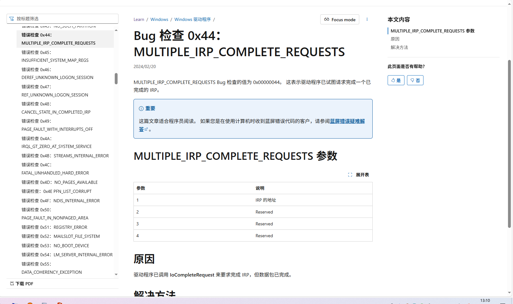
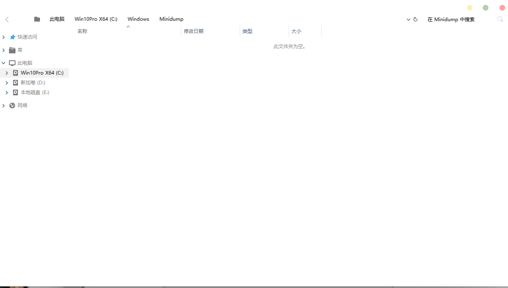
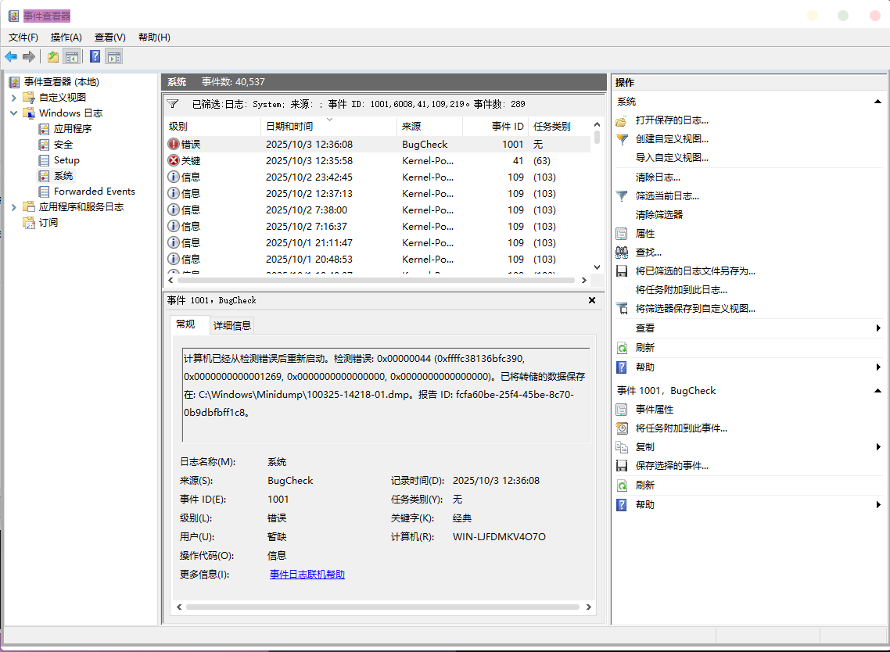
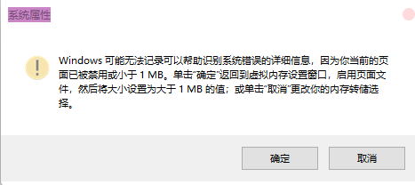
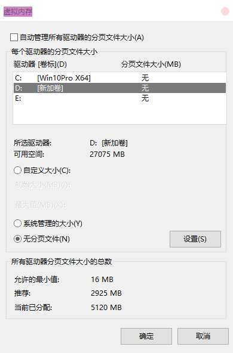
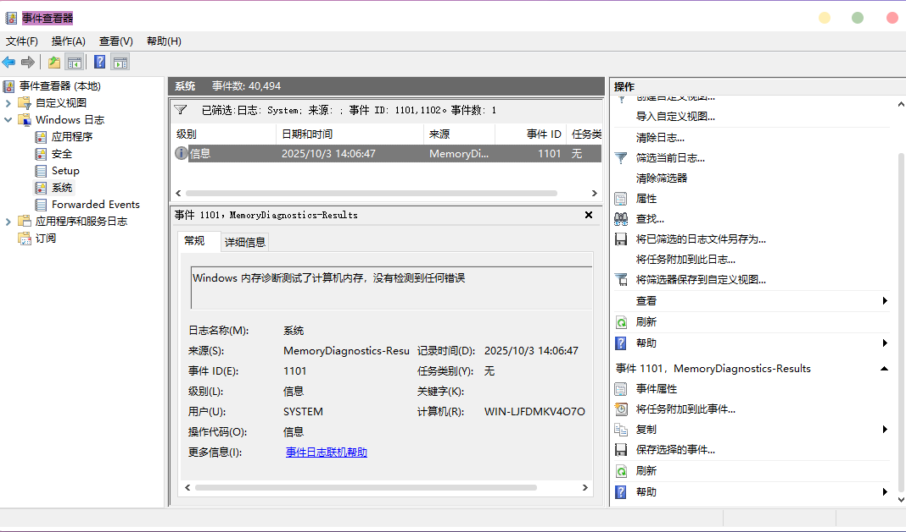

之前，我电脑一直很稳定，上一次蓝屏还是几个月前，但是今天中午我尝试关机时异常出现了


我觉得可能只是偶发没在意，当我重启一下的时候也这样我就有点慌了，去查了下蓝屏代码



这个错误搞得我有点无厘头，我又不玩驱动，我最近也没改什么驱动，驱动级的软件好像也没改啥啊？拿出WinDbg想分析下，结果蓝屏转储目录是空的？？



我去试了各种方法，比如把隐藏文件改成显示，everything搜.dmp文件等，都没用，没辙了，只能看看事件管理器了



有一点点信息但不关键，这个转储文件怎么搜都没搜到，我可以肯定我之前肯定开了转储，没办法，只能看看把小内存转储改成核心内存转储试试了

这不试不知道，一试吓一跳，我第一次看到这个报错



页面文件？虚拟内存？我感觉去看了看，果然



不知道什么时候改的，改回来后问题没解决，但是终于有转储文件了。WinDbg，启动！

最后分析出这些

```(text)
Microsoft (R) Windows Debugger Version 6.12.0002.633 AMD64
Copyright (c) Microsoft Corporation. All rights reserved.


Loading Dump File [C:\Users\xundei\Desktop\100325-14140-01.dmp]
Mini Kernel Dump File: Only registers and stack trace are available

Symbol search path is: SRV*C:\Symbols*http://msdl.microsoft.com/download/symbols
Executable search path is: 
Windows 7 Kernel Version 19041 MP (12 procs) Free x64
Product: WinNt, suite: TerminalServer SingleUserTS
Machine Name:
Kernel base = 0xfffff806`23400000 PsLoadedModuleList = 0xfffff806`2402a3f0
Debug session time: Fri Oct  3 13:12:55.516 2025 (UTC + 8:00)
System Uptime: 0 days 0:37:02.452
Loading Kernel Symbols
...............................................................
................................................................
................................................................
................................................................
...
Loading User Symbols
Loading unloaded module list
.................................
Cannot read PEB32 from WOW64 TEB32 0001cc1a - Win32 error 0n30
*******************************************************************************
*                                                                             *
*                        Bugcheck Analysis                                    *
*                                                                             *
*******************************************************************************

Use !analyze -v to get detailed debugging information.

BugCheck 44, {ffffc40ce0d93980, 1269, 0, 0}

Probably caused by : Unknown_Image ( PAGE_NOT_ZERO )

Followup: MachineOwner
---------

 *** Memory manager detected 117786 instance(s) of page corruption, target is likely to have memory corruption.

4: kd> !analyze -v
*******************************************************************************
*                                                                             *
*                        Bugcheck Analysis                                    *
*                                                                             *
*******************************************************************************

MULTIPLE_IRP_COMPLETE_REQUESTS (44)
A driver has requested that an IRP be completed (IoCompleteRequest()), but
the packet has already been completed.  This is a tough bug to find because
the easiest case, a driver actually attempted to complete its own packet
twice, is generally not what happened.  Rather, two separate drivers each
believe that they own the packet, and each attempts to complete it.  The
first actually works, and the second fails.  Tracking down which drivers
in the system actually did this is difficult, generally because the trails
of the first driver have been covered by the second.  However, the driver
stack for the current request can be found by examining the DeviceObject
fields in each of the stack locations.
Arguments:
Arg1: ffffc40ce0d93980, Address of the IRP
Arg2: 0000000000001269
Arg3: 0000000000000000
Arg4: 0000000000000000

Debugging Details:
------------------


IRP_ADDRESS:  ffffc40ce0d93980

FOLLOWUP_IP: 
+6335643739663266
00000000`00001269 ??              ???

CUSTOMER_CRASH_COUNT:  1

DEFAULT_BUCKET_ID:  VISTA_DRIVER_FAULT

BUGCHECK_STR:  0x44

PROCESS_NAME:  System

CURRENT_IRQL:  0

BAD_PAGES_DETECTED: 1cc1a

LAST_CONTROL_TRANSFER:  from fffff806236443ce to fffff806237fd3c0

STACK_TEXT:  
fffff40f`a577f718 fffff806`236443ce : 00000000`00000044 ffffc40c`e0d93980 00000000`00001269 00000000`00000000 : nt!KeBugCheckEx
fffff40f`a577f720 fffff806`23642e17 : ffffc40c`e0d93980 00000000`00000002 00000000`00000fff 00000000`00000000 : nt!IopfCompleteRequest+0x159e
fffff40f`a577f820 fffff806`3df71d71 : 00000000`00000103 00000000`00000000 1ae00528`ffffed88 00000000`00000000 : nt!IofCompleteRequest+0x17
fffff40f`a577f850 fffff806`27e2b267 : ffffc40c`e20030f8 ffffc40c`e20030c0 fffff40f`a577f940 fffff806`23db4149 : afd!WskProTLCloseEndpointComplete+0x31
fffff40f`a577f890 00000000`00000000 : 00000000`00000000 00000000`00000000 00000000`00000000 00000000`00000000 : tcpip!UdpCleanupEndpointWorkQueueRoutine+0x47


STACK_COMMAND:  kb

SYMBOL_NAME:  PAGE_NOT_ZERO

FOLLOWUP_NAME:  MachineOwner

MODULE_NAME: Unknown_Module

IMAGE_NAME:  Unknown_Image

DEBUG_FLR_IMAGE_TIMESTAMP:  0

BUCKET_ID:  PAGE_NOT_ZERO

Followup: MachineOwner
---------

 *** Memory manager detected 117786 instance(s) of page corruption, target is likely to have memory corruption.

```

其中比较关键的是 **Memory manager detected 117786 instance(s) of page corruption, target is likely to have memory corruption.** 和 **BAD_PAGES_DETECTED: 1cc1a** 这句，意思大意是有大量内存页面损坏，并且发现一个本应全为0的内存页包含了非0数据。but...why？

还有一个点是

```(text)

STACK_TEXT:  
fffff40f`a577f718 fffff806`236443ce : ... : nt!KeBugCheckEx
fffff40f`a577f720 fffff806`236443ce : ... : nt!IopfCompleteRequest+0x159e
fffff40f`a577f820 fffff806`23642e17 : ... : nt!IofCompleteRequest+0x17
fffff40f`a577f850 fffff806`3df71d71 : ... : afd!WskProTLCloseEndpointComplete+0x31
fffff40f`a577f890 00000000`00000000 : ... : tcpip!UdpCleanupEndpointWorkQueueRoutine+0x47

```

这段，从下往上看，最后一个事件是KeBugCheckEx，即蓝屏。我们观察第一个事件，发现和```tcpip```这个事件有关，这是Windows里的**tcpip.sys**驱动，第二个事件是```afd```，这也是一个驱动，为**afd.sys**，都属于Windows的网络部分。这两个事件在尝试清理网络资源，清理网络资源的任务交给了tcpip.sys，它完成后上报给了afd.sys，然后afd.sys尝试上报给系统内核。后面三个事件是NT内核的，内核发现这个请求已经被完成过了，于是立刻抛出错误并蓝屏

但这会是修复的关键吗？不知道，试试吧

我首先把目标确定在内存和网络上，于是我用了自带的内存诊断，等了足足半小时



好消息：你内存没坏

坏消息：没揪出病根

于是我又试了试禁用网络适配器关机、更新网卡的驱动等等，但是也没有任何效果。无奈之下甚至想重装系统，但是我想了想，我不是还有个系统还原吗，先试试再重装吧

我还原到了几天前的版本，发现我的fsecure用不了了，反正我前天已经删了，再删一遍也无所谓。当我用geek删了后，我发现geek里面fs的选项还在，但是当我再点一次卸载的时候跟我说已经卸载了，之前也是这样我就没在意，以为只是个残留项。但我刚好强迫症上头，点了下强制删除看看。结果让我很吃惊，fs的用户界面被删了但是主防护模块倒是一点没动，而且根据我后续在事件管理器排查还发现甚至有个别服务还没删，启动后报错找不到文件。于是我就把文件都删干净了，重启，一切正常

总结：不知道是系统还原还是geek立大功，但是

还原点救我狗命，杀软残留害人不浅